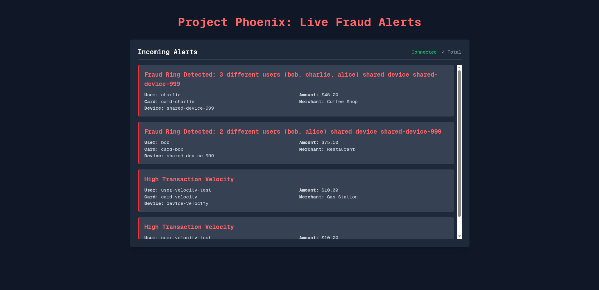

# Project Phoenix - Real-time Fraud Detection System

Detecting fraud in a hidden backend process, but also providing human analysts with a live, intuitive dashboard to visualize transaction flows, identify emerging threats, and investigate suspicious patterns. The project is gonna highlight this and will also push these events to a dynamic web interface, allowing for immediate insight and action. Also incorporating a machine learning model directly into Redis and using graph database capabilities to uncover sophisticated fraud rings.



## Quick Start

### 1. Start the Application
```bash
# Start all services
docker-compose up -d

# Check service status
docker-compose ps
```

### 2. Access the Dashboard
Open your browser to:
- **Fraud Detection Dashboard**: http://localhost:3000
- **API Documentation**: http://localhost:8000/docs
- **RedisInsight**: http://localhost:8001

### 3. Run Automated Tests
```bash
# Make the test script executable (first time only)
chmod +x test_scenarios.sh

# Run all test scenarios
./test_scenarios.sh
```

This will automatically test:
- High-velocity fraud detection (12 rapid transactions)
- Fraud ring detection (multiple users on same device)
- Normal transactions (no false positives)

Watch the alerts appear in real-time at http://localhost:3000! 🚀

### 4. Stop the Application
```bash
docker-compose down
```

## Service Ports

| Service | Port | Description |
|---------|------|-------------|
| Frontend Dashboard | 3000 | Live fraud alerts visualization |
| Backend API | 8000 | REST API for transactions |
| Redis Stack | 6379 | Redis database |
| RedisInsight | 8001 | Redis GUI management tool |
| PostgreSQL | 5814 | Database (for future features) |

# Architecture #
```
                                      +--------------------------+
                                      |   Next.js Frontend       |
                                      | (Dashboard, Visuals)     |
                                      +-------------+------------+
                                                    ^
                                                    | (WebSocket for Live Updates)
                                                    |
+-------------------+      +--------------------+   |   +--------------------------+
| Transaction       |----->|   FastAPI Backend  |---+-->|   Redis Pub/Sub          |
| Simulator (Script)|      | (API Endpoints)    |   |   | (fraud_alerts channel)   |
+-------------------+      +--------------------+   |   +--------------------------+
                                      |             |
           (Enqueues Task via `arq`)  |             | (Publishes alert)
                                      v             ^
+---------------------------------------------------+------------------------------------+
|                                 Redis Stack                                            |
|                                                                                        |
|  +---------------+      +----------------+      +---------------+      +------------+  |
|  | `arq` Queue   |----->|   `arq` Worker |----->|  RedisGraph   |----->| RedisAI    |  |
|  | (Job List)    |      | (Fraud Logic)  |      |(Relationships)|      | (ML Model) |  |
|  +---------------+      +----------------+      +---------------+      +------------+  |
|                                                                                        |
+----------------------------------------------------------------------------------------+
```

# Manual Testing Scenarios #

If you prefer to test manually instead of using the automated script, here are the individual test commands:

## Method 1: Use the Automated Test Script (Recommended) ##
```bash
./test_scenarios.sh
```

## Method 2: Manual Testing ##

### High Velocity Fraud ###
```
curl -X POST -H "Content-Type: application/json" -d '{
  "user_id": "user-high-velocity",
  "card_id": "card-hv",
  "device_id": "device-hv",
  "amount": 10.00,
  "merchant": "Gas Station"
}' http://localhost:8000/transaction
```

**Or send multiple transactions rapidly:**
```bash
# Send 12 transactions quickly to trigger high-velocity alert
for i in {1..12}; do 
  curl -X POST -H "Content-Type: application/json" -d '{
    "user_id": "user-high-velocity",
    "card_id": "card-hv",
    "device_id": "device-hv",
    "amount": 10.00,
    "merchant": "Gas Station"
  }' http://localhost:8000/transaction
done
```

### Fraud Ring ###
```
# First, a transaction from a new user on a specific device
curl -X POST -H "Content-Type: application/json" -d '{
  "user_id": "user-ring-1",
  "card_id": "card-ring-1",
  "device_id": "device-shared-123",
  "amount": 150.00,
  "merchant": "Online Store"
}' http://localhost:8000/transaction

# Second, a transaction from a DIFFERENT user on the SAME device
curl -X POST -H "Content-Type: application/json" -d '{
  "user_id": "user-ring-2",
  "card_id": "card-ring-2",
  "device_id": "device-shared-123",
  "amount": 25.50,
  "merchant": "Coffee Shop"
}' http://localhost:8000/transaction
```

**Expected Result:** You should see a "Fraud Ring Detected" alert on the dashboard showing that 2 different users shared the same device!

## Monitoring & Debugging

### Check Service Logs
```bash
# View all logs
docker-compose logs -f

# View specific service logs
docker-compose logs -f api      # API backend
docker-compose logs -f worker   # Fraud detection worker
docker-compose logs -f frontend # Next.js frontend
```

### Check Worker Processing
```bash
# See fraud alerts in real-time
docker-compose logs -f worker | grep ALERT
```

### View Redis Data
- Open RedisInsight at http://localhost:8001
- Connect to redis://localhost:6379
- Explore keys like `device:*:users` and `user:*:tx_count`

## Fraud Detection Features

### 1. High Transaction Velocity
- **Rule**: More than 10 transactions from the same user within 60 seconds
- **Alert**: "High Transaction Velocity"

### 2. Fraud Ring Detection
- **Rule**: Multiple different users using the same device
- **Alert**: "Fraud Ring Detected: N different users shared device X"

## Troubleshooting

### Services not starting?
```bash
# Rebuild all containers
docker-compose down
docker-compose up --build -d
```

### Frontend not showing alerts?
1. Check if WebSocket is connected (look for connection status in dashboard)
2. Verify API is running: `curl http://localhost:8000/docs`
3. Check browser console for errors

### Worker not processing jobs?
```bash
# Check worker logs
docker-compose logs worker

# Restart worker
docker-compose restart worker
```
